# Ćwiczenie: Baza danych MS SQL Server w Azure

## Krok 1 Utworzenie konta w Azure

Zalogowano się w Azure Portal, przedłużając (po studiach inżynierskich) subskrypcję Azure for Students.

## Krok 2 Utworzenie instancji Azure SQL Database

Stworzono zasób SQL Database.

a. Tworzenie zasobu\
Wybrano opcję "Create" SQL Database

b. Konfiguracja projektu\
Stworzono nową grupę zasobów i wpisano nazwę dla bazy danych.

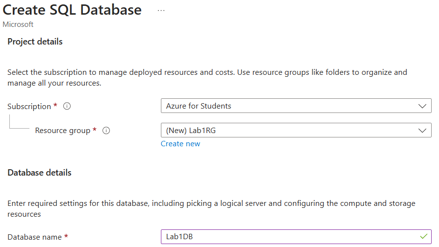

d. Konfiguracja serwera\
Stworzono nowy serwer.

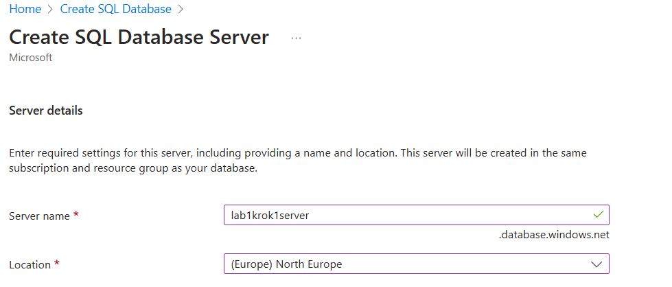

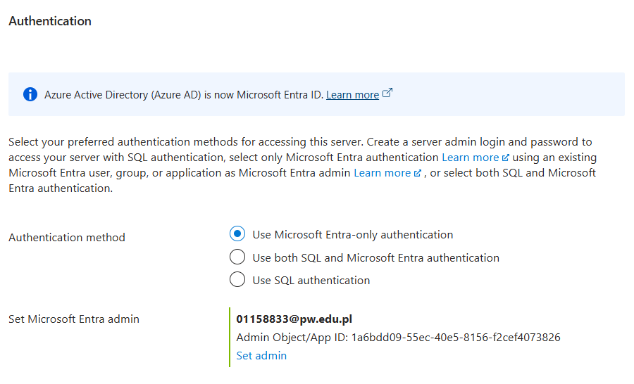

e. Wybór opcji cenowych i rozmiaru \
Wybrano zasugerowane opcje rozmiarowe.
- General Purpose
- Serverless

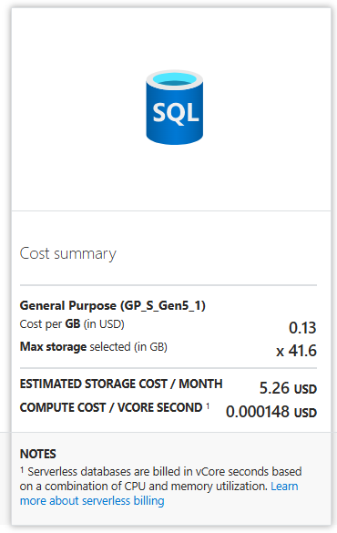

f. Dodatkowe ustawienia \
Wybrano domyślne ustawienia.

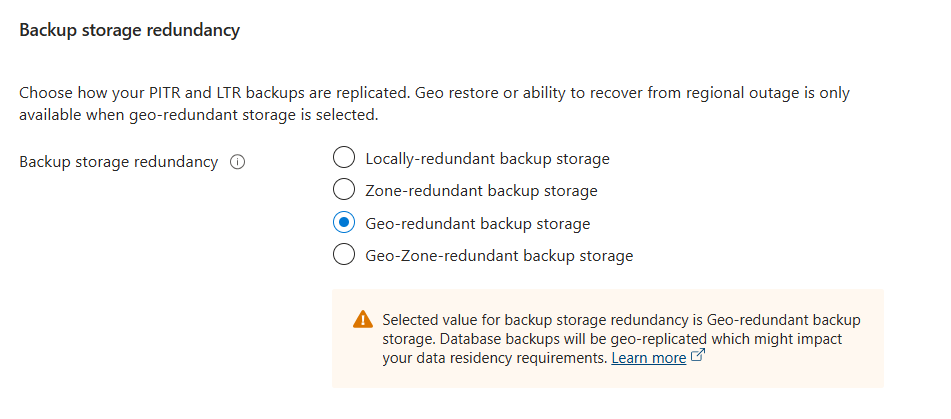

## Krok 3 Zatwierdzenie i wdrożenie
Zatwierdzono i utworzono zasób.

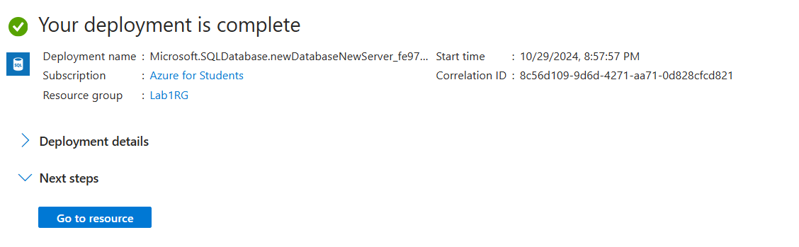

## Krok 4 Połączenie z bazą danych

Połączono z bazą danych za pomocą SSMS.

## Krok 5: Tworzenie aplikacji
Stworzono aplikację .NET (w folderze Lab1App).

Podczas tworzenia bazy danych, nie było opcji wybrania przykładowej bazy, dlatego w ramach kroku 5, utworzono przykładową tabelę za pomocą SSMS. Wstawiono przykładowe dane:

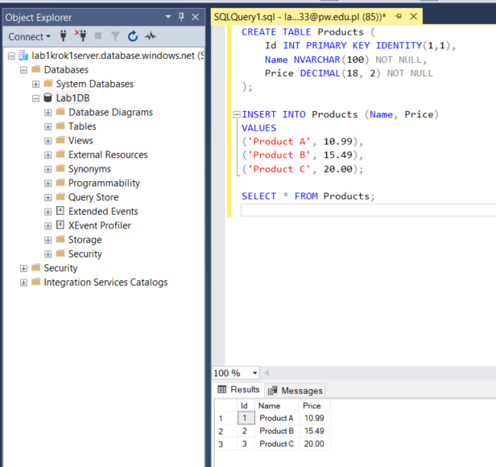

Po uruchomieniu aplikacji, wyświetlają się dane w konsoli użytkownika:

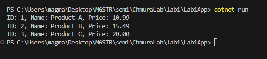

## Krok 6: Konfiguracja maszyny wirtualnej

Stworzono maszynę wirtualną z SQL Server.

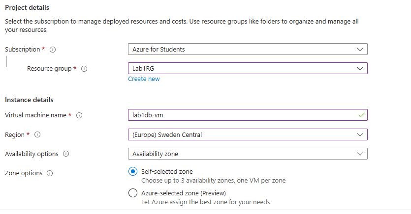

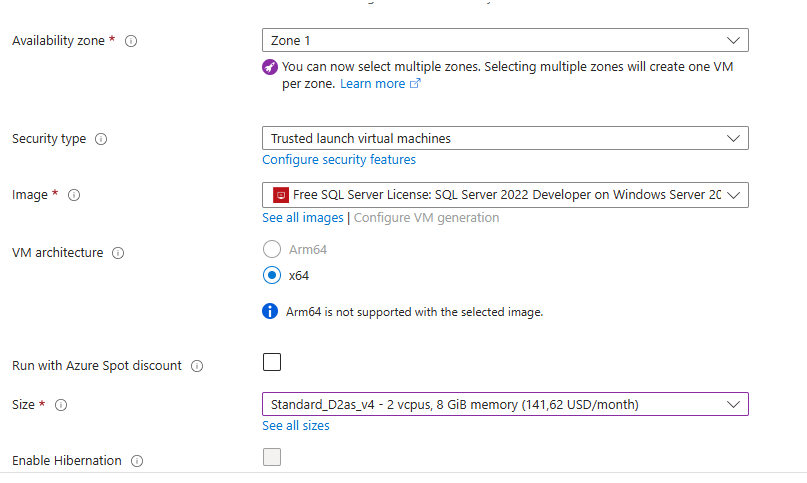

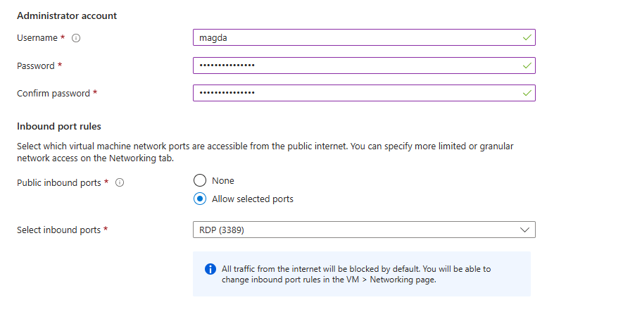

Skonfigurowano reguły sieciowe:

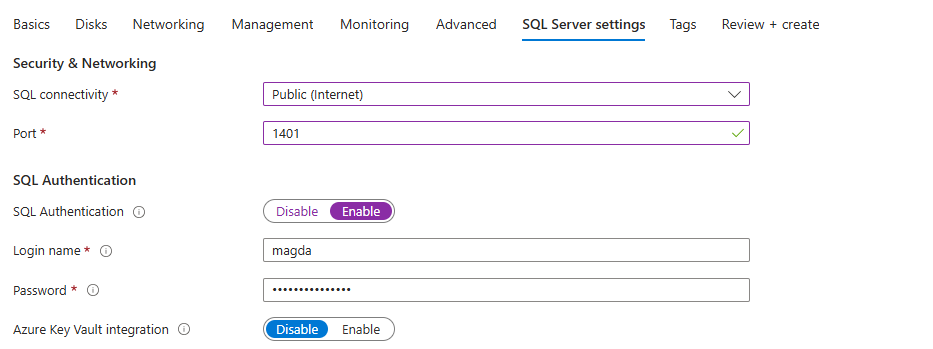

Uruchomiono maszynę wirtualną:

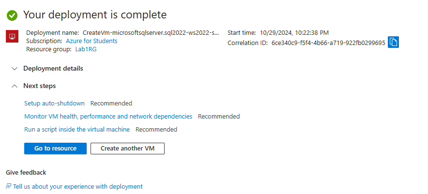

Połączono się przez SSMS:

## Krok 7

## Konfiguracja Firewalla Azure SQL Database

Dodano mój obecny adres IP poprzez opcję "Set server firewall"

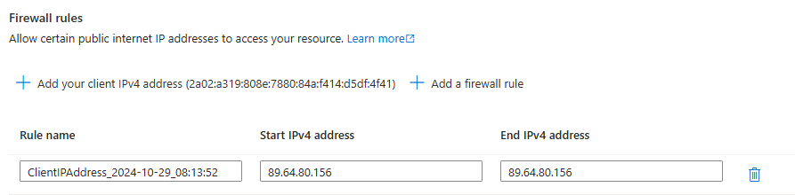
