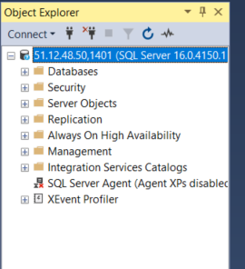

# Ćwiczenie: Baza danych MS SQL Server w Azure

Magdalena Markowicz 310836

Wykonanio ćwiczenie za pommocą interfejsu portalu Azure.

## Krok 1 Utworzenie konta w Azure

Zalogowano się w Azure Portal, przedłużając (po studiach inżynierskich) subskrypcję Azure for Students.

## Krok 2 Utworzenie instancji Azure SQL Database

Stworzono zasób SQL Database.

__a. Tworzenie zasobu__\
Wybrano opcję "Create" SQL Database

__b. Konfiguracja projektu__\
Stworzono nową grupę zasobów i wpisano nazwę dla bazy danych.

__d. Konfiguracja serwera__\
Stworzono nowy serwer.

__e. Wybór opcji cenowych i rozmiaru__ \
Wybrano zasugerowane opcje rozmiarowe.
- General Purpose
- Serverless

__f. Dodatkowe ustawienia__ \
Wybrano domyślne ustawienia.

## Krok 3 Zatwierdzenie i wdrożenie
Zatwierdzono i utworzono zasób poprzez kliknięce w "Review + Create" a potem, po przejrzeniu wpisanych danych, w "Create".

## Krok 4 Połączenie z bazą danych

Połączono z bazą danych za pomocą SSMS. W tym celu, w panelu łączenia:
- wybrano opcję Server type: Database Engine
- znaleziono pełną nazwę serwera w wyświetlonych danych w azure portal (lab1krok1server.database.windows.net) i wpisano ją w pole Server name
- Wybrano opcję logowania Microsoft Entra MFA i wpisano mój login
- Wybrano opcję Encryption: Strict

i kliknięto w przycisk "Connect".

Zrzut ekranu potwierdzający połączenie znajduje się poniżej, w kroku 5.

## Krok 5: Tworzenie aplikacji
Stworzono aplikację .NET (w folderze Lab1App). \
Stworzono nowy projekt za pomocą komendy `dotnet new console -o Lab1App` i zainstalowano Entity Framework za pomocą komenty `dotnet tool install --global dotnet-ef`.

Następnie stworzono folder `Models`, a w nim klasę modelową `Product` oraz stworzono folder `Data` i w nim klasę `AppDBContext`, która odpowiadała za łączenie się z odpowiednią bazą i opcje logowania. Connection string pobrano z danych bazy w azure portal. W celu zalogowania się do azure przez aplikację, wybrano opcję `InteractiveBrowserCredential` aby zalogować się przez przeglądarkę.
W pliku `Program.cs` stowrzono nowy kontekst `AppDBContext`, tym samym łącząc się z bazą, a następnie pobrano dane i je wyświetlono.

Podczas tworzenia bazy danych, nie było opcji wybrania przykładowej bazy, dlatego w ramach kroku 5, utworzono przykładową tabelę za pomocą SSMS. Wstawiono przykładowe dane:

Po uruchomieniu aplikacji, wyświetlają się dane w konsoli użytkownika:

## Krok 6: Konfiguracja maszyny wirtualnej

Stworzono maszynę wirtualną z SQL Server.

Wybrano tą samą resource group co w poprzednich krokach (`Lab1RG`) i nadano nazwę `lab1db-vm`. Wybrano region `Sweden Central`. Wybrano też najtańszy rozmiar bazy dostępny w tym regionie i dla mojego rodzaju konta, czyli `Standard_D2as_v4`.

Skonfigurowano reguły sieciowe:

Umożliwiono dostęp publiczny na porcie `1401` (zgodnie z tutorialem na stronie azure).

Wybrano opcję 'Review + Create' i potem 'Create', uruchamiając tym samym maszynę wirtualną:

Połączono się przez SSMS.
- wybrano opcję Server type: Database Engine
- znaleziono pełną nazwę serwera w wyświetlonych danych w azure portal (51.12 ...) i wpisano ją w pole Server name
- Wybrano opcję logowania SQL Server Authentication i wpisano login i hasło ustawione podczas kreacji
- Wybrano opcję Encryption: Optional \

i kliknięto w przycisk "Connect".

## Krok 7

__Tworzenie tabeli:__

Stworzono storage account:

Kliknięto w "Review + Create" a następnie w "Create":

Stworzono tabelę (poprzez przejście Data Storage > Tables > + Table):

Po stworzeniu nowej tabli, nie pojawiła się żadna opcja dodania atrybutów ani danych. Usunięto i stworzono ponownie Storage account, lecz resultat był ten sam, co uniemożliwyło wykonanie reszty Kroku 7.

## Konfiguracja Firewalla Azure SQL Database

Dodano mój obecny adres IP poprzez opcję "Set server firewall" na górnym pasku, powyżej danych mojej bazy danych.

# Azure Cosmos DB

## 1. Stworzenie konta Azure Cosmos DB:

Stworzono konto AzureCosmosDB w grupie `Lab1RG`, o nazwie `magdacosmosdbaccount`. \
Wybrano region `Poland Central`, ponieważ jest najbliżej mnie.

Nowe konto AzureCosmosDB można stworzono przechodząc do Services > Azure Cosmos DB i wybierając opcję '+ Create'. Potem, wybrano API i podano dane konta, takie jak resource group, nazwę konta, region, itp. Wybrany region `Poland Central` wymagał ustawienia opcji kopii zapasowych, więc wybrano `Locally-reduntant backup storage` w Backup Policy > Backup storage redundancy. W innych ustawieniach (poza Basics i Backup Policy) zostawiono wartości domyślne.

## 2. Tworzenie bazy danych i kontenera:

Stworzono nową bazę danych `ShopDB` wraz z kontenerem `Products`. Jako partition key (klucz partycjonowania) wybrano `/productCategory` czyli kategorię produktu.

Nową bazę danych i kontener stworzono poprzez przejście do Data Explorer > + New Container. Podano nazwę bazy danych (stworzono nową), ID (nazwę) kontenera, wybrano Partition Key i RU/s.

## 3. Dodawanie i pobieranie danych:

Skorzystano z Data Explorer aby dodać dokumenty JSON do kontenera:

Dane miały swoje id, kategorię (klucz partycjonowania), nazwę oraz cenę.

Dodano dane poprzez przejście do Data Explorer > Products (nazwa kontenera) > Items > New Item. Po wpisaniu nowych danych, wybrano guzik 'Save'.

Wykonano zapytanie o produkty z kategorii "food":

Zapytania wykonano przechodząć do Data Explorer > New SQL Query. Po zapytaniu i uruchomieniu, odpowiedź pojawiła się w konsoli, tak jak w załączonym obrazie powyżej.

## 4. Skalowanie i monitorowanie:

__Możliwości skalowania poziomego:__

Azure Cosmos DB umożliwia poziome skalowanie poprzez:
1) Patrycjonowanie logiczne
   - wybrany podczas kreacji kontenera klucz partycji (Partition Key) ustala sposób rozkładu danych w bazie. Klucz powinien być wybrany tak, aby dane równomiernie się rozkładały
2) Patrycjonowanie fizyczne
   - skalowanie odbywa się poprzez dystrybucję danych na fizyczne partycje.
   - partycjonowanie fizyczne nie jest obsługiwane przez użytkowników, tylko przez Azure
   - poprawne wybranie klucza Partition Key (tak, aby dane były równomiernie rozdystrybuowane) umożliwia poprawną partycję fizyczną
3) Zarządzanie liczbą jednostek przetwarzania żądań
   - RU/s określa ilość jednostek przetwarzania (jednostek obliczeniowych) dostępnych dla operacji i zapytań
   - możliwe jest skalowanie automatyczne RU/s

źródło: https://learn.microsoft.com/en-us/azure/cosmos-db/partitioning-overview

__Modyfikacja liczby jednostek przetwarzania żądań:__

Podjęto próbę modyfikacji liczby jednostek przetwarzania żądań. Ponieważ liczby ta musi być wielokrotnością 1000, wybrano wartość 2000:

Próba zmiany RU/s nie powiodła się, ponieważ wartość 1000 jest jedyną możliwość opcją dla mojego typu konta (Azure for Students).

Modyfikację liczby jednostek przetwarzania żądań wykonano poprzez przejścię do Container > Scale i ustawienie nowej wartości RU/s.

__Monitorowanie wykorzystania i wydajności:__

Aby prześledzić wykorzystanie i wydajność bazy danych, skorzystano z opcji "Metrics" Azure Monitor. Opcja Metrics pozwala na tworzenie wykresów zużycia i monitorowanie efektywności bazy danych.

Można w niej np. zobaczyć ilość dokumentów (Document sum):

Można też nanieść na wykres łączną ilość zapytań (Total Requests):

Aby stworzyć taki graf, należy przejść do opcji Metrics w Azure Monitor i ustawiając opcję 'Scope' jako swoje konto CosmosDB. Następnie, należy wybrać pierwszą interesującą nas metrykę. Więcej metryk można dodać klikając w '+ Add Metric'.

## 5. Integracja z aplikacją:

Wykorzystując Azure Cosmos DB SDK, napisano prostą aplikację w C# (folder Lab1CosmosApp). \
Łączy się ona z moją bazą danych i wykonuje operacje CRUD na danych.

Aby wykonać zadanie, stworzono nowy projekt za pomocą komenty `dotnet new console -o Lab1CosmosApp`, a następnie w folderze aplikacji zainstalować Azure Cosmos DB SDK `dotnet add package Microsoft.Azure.Cosmos`.

Połączenie z bazą danych zrealizowano za pomocą instancji klasy `CosmosClient`, do której podano `URI endpointu` i klucz `Primary Key` (oba znaleziono w Settings > Keys po przejściu do konta Cosmos DB).

---

Po zakończeniu ćwiczenia, wyczyszczono środowisko aby stworzone zasoby nie zużywały dostępnych środków.

