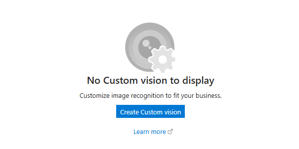
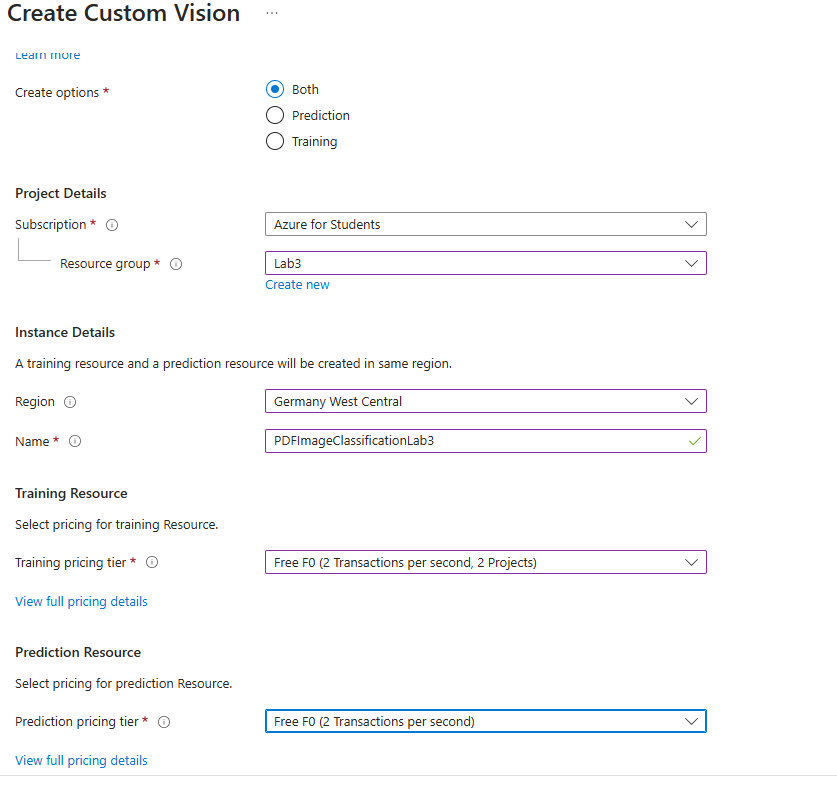
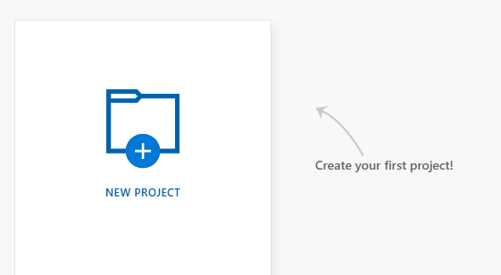
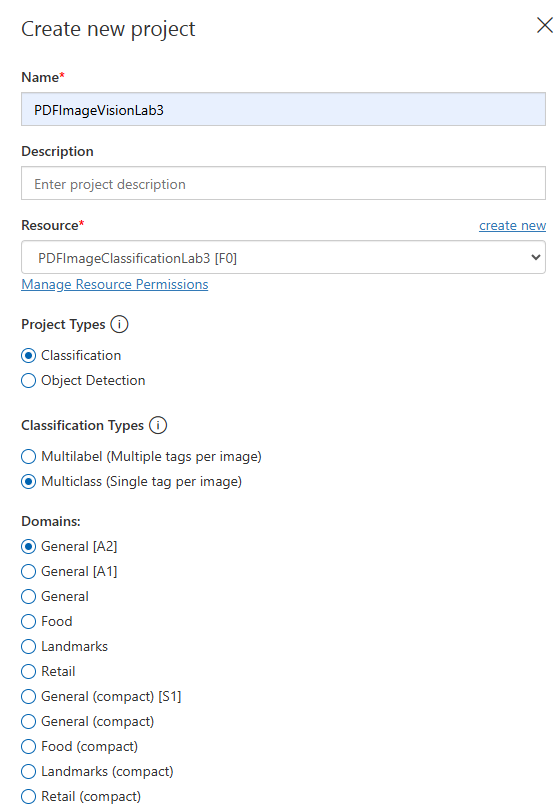
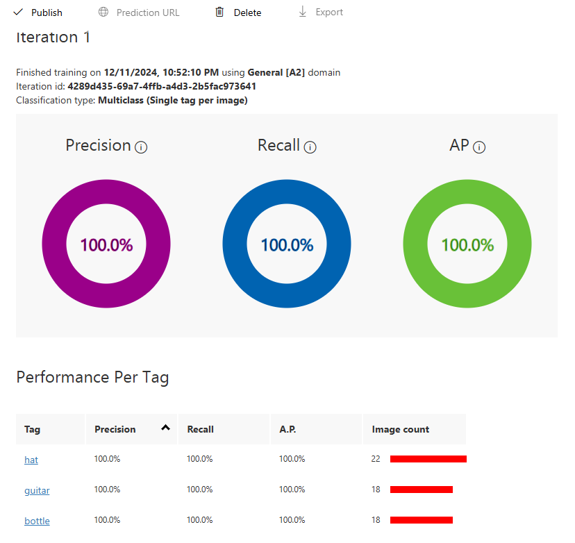
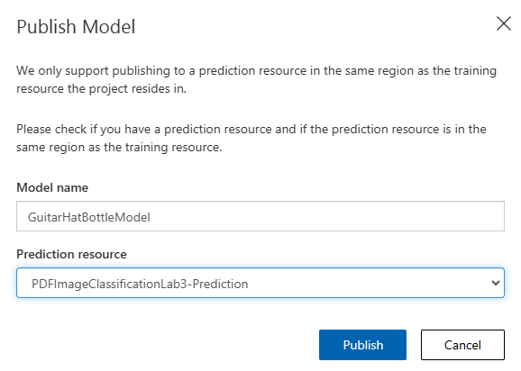
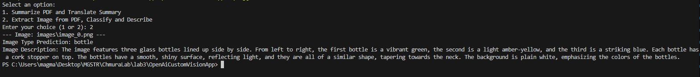
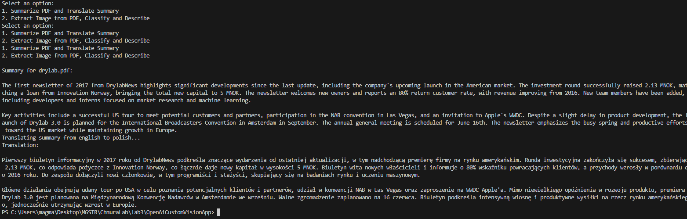

## Lab 2 - zadanie

Magdalena Markowicz 310836

Link do repozytorium z rozwiązaniem zadania: https://github.com/mm-owicz/AzureLab/tree/main/zad1

Projekt bazowy (temat 4 / lab 2) + Custom Vision AI + Temat 10

### Zadania

__Zad 4 - Tworzenie streszczenia treści dokumentu PDF__ \
Opis zadania:
   - Korzystając z OpenAI API (np. GPT-4), załaduj plik PDF, a następnie prześlij jego zawartość do modelu, aby wygenerował streszczenie.
   - Wygenerowane streszczenie zapisz w pliku i wyświetl w konsoli.
   - Program powinien mieć możliwość wygenerowania streszczeń wielu plików umieszczonych w folderze

__Custom Vision AI__\
Zdecydowano się na użycie Custom Vision AI w celu klasyfikacji zdjęć znalezionych w plikach PDF. Program sczytuje znalezione zdjęcia i je zapisuje, wysyła zapytanie do Custom Vision API w celu klasyfikacji, a następnie wysyła zapytanie do OpenAI w celu uzyskania opisu zdjęcia. Custom Vision zostało wytrenowane na przykładowym zbiorze zdjęć obejmującym butelki, kapelusze i gitary.

__Zad 10 - Tłumaczenie tekstu za pomocą OpenAI API__\
Opis zadania
   - Program powinien akceptować tekst w dowolnym języku i tłumaczyć go na inny język wybrany przez użytkownika (np. polski -> angielski).


Projekt będący połączeniem powyższych 3 zadań może wykonać jedną z dwóch czyności wybranych przez użytkownika: podsumować tekst z pliku PDF i przetłumaczyć podsumowanie lub może sczytać zdjęcia z pliku PDF i zaklasyfikować je za pomocą Custom Vision (i uzyskać opis z OpenAI).

**Modyfikacja kodu Main** \
Zmodyfikowano kod Main aby zmienić funkcjonalność programu po Lab2:

Dodano folder images:

```c#
string imageFolder = @"images";

Directory.CreateDirectory(imageFolder);
```

oraz wspomnianą powyżej opcję wybrania opcji:
```c#
Console.WriteLine("Select an option:");
Console.WriteLine("1. Summarize PDF and Translate Summary");
Console.WriteLine("2. Extract Image from PDF, Classify and Describe");
Console.Write("Enter your choice (1 or 2): ");
string choice = Console.ReadLine();

switch (choice)
{
   case "1":
      Console.Write("Enter the source language code (fromLang, e.g., 'english'): ");
      string fromLang = Console.ReadLine();

      Console.Write("Enter the target language code (toLang, e.g., 'polish'): ");
      string toLang = Console.ReadLine();

      foreach (var pdfFile in pdfFiles)
      {
         string summary = await GetSummaryConsoleFile(client, pdfFile, summaryFolder);
         await GetTranslation(client, summary, fromLang, toLang);
      }
      break;
   case "2":
      foreach (var pdfFile in pdfFiles)
         {
            ProcessPDFImages(client, pdfFile);
         }
         break;

   default:
      Console.WriteLine("Invalid choice. Please select either 1 or 2.");
      break;
}
```


**Potrzebne biblioteki:**
```
 <ItemGroup>
    <PackageReference Include="Docnet.core" Version="2.6.0" />
    <PackageReference Include="Microsoft.Azure.CognitiveServices.Vision.CustomVision.Prediction" Version="2.0.0" />
    <PackageReference Include="Microsoft.Azure.CognitiveServices.Vision.CustomVision.Training" Version="2.0.0" />
    <PackageReference Include="OpenAI" Version="2.0.0" />
    <PackageReference Include="PdfPig" Version="0.1.9" />
    <PackageReference Include="System.Drawing.Common" Version="9.0.0" />
  </ItemGroup>
```

## Custom Vision AI

### Azure

W pierwszym kroku, znaleziono service 'Custom Vision' w Azure Portal'u i wybrano opcję `Create Custom vision`:



Stworzono zasób Custom Vision. Stworzono do niego nową grupę Resource Group i wybrano lokalizację North Europe:



Po ustawieniu wszystkich opcji tworzenia, kliknięto w Review + Create, a następnie w Create. Po utworzeniu się zasobu, kliknięto w `PDFImageVisionLab3` i wybrano opcję przejścia do `Custom Vision portal`.


Kliknięto w `NEW PROJECT`:



i podano dane nowego projektu:



Przetrenowano model na przykładowym zbiorze danych: https://github.com/esdanielgomez/ObjectDetection/tree/main/General%20Dataset

Za pomocą GUI Custom Vision Portal, wstawiono zdjęcia i ich tagi i przeprowadzono uczenie modelu.



Wybrano opcję `Publish`.



### Aplikacja C#

Metodą obsługującą funkcjonalność klasyfikacji obrazków z PDFów jest ProcessPDFImages


```c#
static async Task ProcessPDFImages(ChatClient client, string filePath){
   ExtractImagesAndSaveToFile(filePath);

   string imageFolder = @"images";
   var images = Directory.GetFiles(imageFolder, "*.png");
   foreach(var image in images){
      GetPredictionAndDescription(client, image);
      File.Delete(image);
   }

}
```
Pobiera oraz zapisuje ona obrazy z plików PDF i przesyła je do metody obsłującej zdobycie klasyfikacji i opisu obrazu.

Wydobywanie obrazów z plików PDF zaimplementowano za pomocą biblioteki PdfPig:

```c#
public static void ExtractImagesAndSaveToFile(string filePath)
{

   byte[] pdfBytes = File.ReadAllBytes(filePath);
   string outputDirectory = "images";

   using var document = PdfDocument.Open(pdfBytes);
   int imageCount = 0;

   foreach (var page in document.GetPages())
   {
      foreach (var pdfImage in page.GetImages())
      {
         var bytes = TryGetImage(pdfImage);
         using var mem = new MemoryStream(bytes);
         System.Drawing.Image img;
         try
         {
            img = System.Drawing.Image.FromStream(mem);
         }catch (Exception)
         {
            continue;
         }

         string fileName = Path.Combine(outputDirectory, $"image_{imageCount++}.png");

         img.Save(fileName, ImageFormat.Png);
      }
   }
}

private static byte[] TryGetImage(IPdfImage image)
{
   if (image.TryGetPng(out var bytes))
      return bytes;

   return image.RawBytes.ToArray();
}
```

Metoda GetPredictionAndDescription:
```c#
static async Task GetPredictionAndDescription(ChatClient client, string imagePath){
   Console.WriteLine($"--- Image: {imagePath} ---");
   byte[] imageBytes = File.ReadAllBytes(imagePath);

   var prediction = await PredictImageType(imageBytes);
   Console.WriteLine($"Image Type Prediction: {prediction}");

   string description = await GenerateImageDescription(client, imagePath, prediction);
   Console.WriteLine($"Image Description: {description}");
}
```

Metoda obsługująca predykcję:

```c#
static async Task<string> PredictImageType(byte[] imageBytes){
   string endpoint = "https://pdfimageclassificationlab3-prediction.cognitiveservices.azure.com/";
   string predictionKey = "mój api key";
   string projectId = "projekt id";
   string modelName = "GuitarHatBottleModel";


   var client = new CustomVisionPredictionClient(
      new Microsoft.Azure.CognitiveServices.Vision.CustomVision.Prediction.ApiKeyServiceClientCredentials(predictionKey))
   {
      Endpoint = endpoint
   };

   Stream stream = new MemoryStream(imageBytes);
   var result = client.ClassifyImage(Guid.Parse(projectId), modelName, stream);
   if (result.Predictions.Count > 0)
   {
      return result.Predictions[0].TagName;
   }
   else
   {
      return "No prediction made";
   }

}
```

Metoda pozyskująca opis zdjęcia od OpenAI:
```c#
static async Task<string> GenerateImageDescription(ChatClient client, string imageFilePath, string type)
{
   using Stream imageStream = File.OpenRead(imageFilePath);
   BinaryData imageBytes = BinaryData.FromStream(imageStream);

   List<ChatMessage> messages =
   [
      new UserChatMessage(
            ChatMessageContentPart.CreateTextPart($"Please describe the following image. It was labelled with {type}."),
            ChatMessageContentPart.CreateImagePart(imageBytes, "image/png")),
      ];

   ChatCompletion completion = client.CompleteChat(messages);
   return completion.Content[0].Text;
}
```

## OpenAI tłumaczenie (temat 10)

Konto OpenAI zostało założone podczas Lab2.

W ramach realizacji tematu 10, podsumowanie pliku PDF jest tłumaczone na wybrany język.

### Aplikacja C#

Tworzenie podsumowania zostało zaimplementowane podczas lab 2.

Tłumaczeniem zajmują się następujące metody:

```c#
static async Task GetTranslation(ChatClient client, string text, string fromLang, string toLang){
   Console.WriteLine($"Translating summary from {fromLang} to {toLang}...");

   string trans = await GenerateTranslation(client, text, fromLang, toLang);

   Console.WriteLine($"Translation: \n");
   Console.WriteLine(trans);
}

static async Task<string> GenerateTranslation(ChatClient client, string text, string fromLang, string toLang)
{
   ChatCompletion completion = client.CompleteChat($"Translate this text from {fromLang} to {toLang}: {text}");

   return completion.Content[0].Text;
}
```

# Przykłady

## Custom Vision - przykład

Wrzucono do folderu PDFs plik ex1.pdf, który zawiera zdjęcie butelek.



Jak widać, obrazek został dobrze zaklasyfikowany, o czym świadczy opis mówiący o butelkach.

## Tłumaczenie - przykład

Wrzucono plik drylab.pdf użyty również w poprzednim labie do folderu PDFs.



Jak widać, program pozwolił na wybór języków i poprawnie przetłumaczył tekst.
