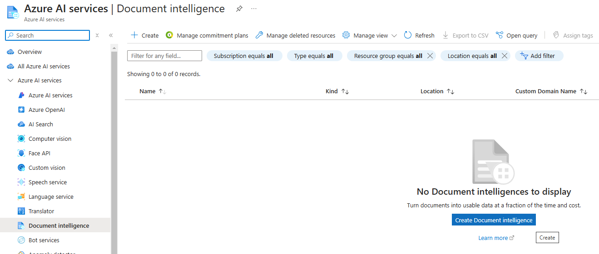
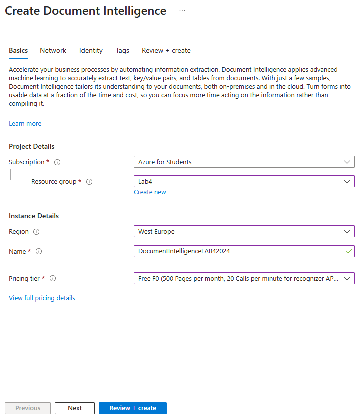
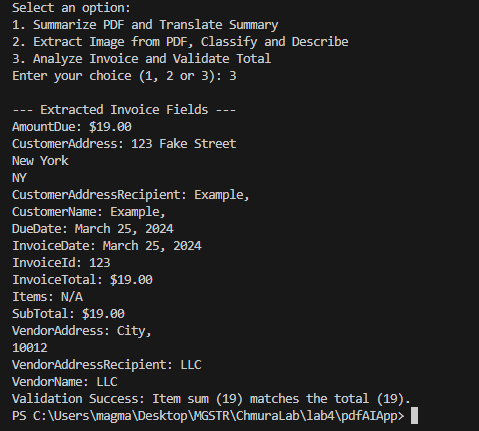
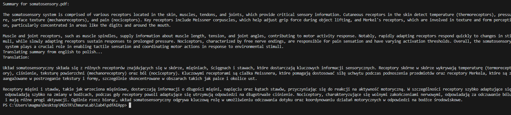

## Lab 4 - zadanie

Magdalena Markowicz 310836

Link do repozytorium z rozwiązaniem zadania: https://github.com/mm-owicz/AzureLab/blob/main/lab4/zad.md

Projekt bazowy (lab 3 - temat 4, Custom Vision AI, temat 10) + Custom Document + Temat 1


### Zadania

__Projekt bazowy:__

Projekt bazowy może wykonać jedną z dwóch czyności wybranych przez użytkownika: podsumować tekst z pliku PDF i przetłumaczyć podsumowanie lub może sczytać zdjęcia z pliku PDF i zaklasyfikować je za pomocą Custom Vision (i uzyskać opis z OpenAI).

__Zad 1 - Analiza dokumentu PDF i wyodrębnienie kluczowych danych__
   **Opis zadania:**
   - Stwórz program w języku C#, który korzysta z Azure Document Intelligence do analizy dokumentu PDF (np. faktury).
   - Wyodrębnij z dokumentu takie informacje jak: numer faktury, data, kwota brutto/netto, oraz nazwisko odbiorcy.
   - Policz sumę wartości pozycji i zweryfikuj czy zgadza się ona z polem "suma".

__Custom Document:__
Zdecydowano się na użycie Azure Document Intelligence - Custom Document w 2 celach:
- w celu zrealizowania zadania 1 - analiza faktur
- w celu wyodrębnienia tekstu który następnie zostanie streszczony i przetłumaczony (treść zadań 4 i 10 w projekcie bazowym)

## Przygotowanie Azure Document Intelligence

W portalu Azure wyszukano serwis Azure Document Intelligence i wybrano opcję `Create`



Wypełniono formularz tworzenia zasobu. Stworzono nowy Resource Group i nadano nazwę zasobowi.




## Aplikacja

Stworzono nową aplikacje za pomocą komendy `dotnet new console -n pdfAIApp` i dodano biblioteki używane w projekcie bazowym:

```cs
  <ItemGroup>
    <PackageReference Include="Docnet.core" Version="2.6.0" />
    <PackageReference Include="Microsoft.Azure.CognitiveServices.Vision.CustomVision.Prediction" Version="2.0.0" />
    <PackageReference Include="Microsoft.Azure.CognitiveServices.Vision.CustomVision.Training" Version="2.0.0" />
    <PackageReference Include="OpenAI" Version="2.0.0" />
    <PackageReference Include="PdfPig" Version="0.1.9" />
    <PackageReference Include="System.Drawing.Common" Version="9.0.0" />
  </ItemGroup>
```

Dodano bibliotekę służącą do obsługi komunikacji z Azure Document Intelligence:
```cs
<PackageReference Include="Azure.AI.DocumentIntelligence" Version="1.0.0-beta.3" />
```

Kod obsługujący zakres projektu bazowego pozostał w dużej mierze ten sam. Zamieniono jednak wyodrębnianie tekstu z pliku PDF za pomocą zewnętrznej biblioteki na wyodrębnianie go za pomocą modelu Document Intelligence.

### Document Intelligence - wyodrębnianie informacji z faktur (Zadanie 1)

Zmodyfikowano metodę Main dodając do niej zmienne przechowujące informację o endpoint'cie i kluczu API zasobu Document Intelligence:

```cs
string endpoint = "https://documentintelligencelab42024.cognitiveservices.azure.com/";
string apiKey = "mój api key";
```

Dodano metodę `AnalyzeInvoiceAndValidateTotal(string endpoint, string apiKey, string filePath)` obsługującą funkcjonalność opisaną w treści Zadania 1: wyodrębnianie informacji z faktury i podliczenie wartości kosztów (i porównanie z wymienioną sumą).

Najpierw, tworzony jest klient `DocumentIntelligenceClient` obsługujący komunikację z stworzonym zasobem:

```cs
var credential = new AzureKeyCredential(apiKey);
var client = new DocumentIntelligenceClient(new Uri(endpoint), credential);
```

Następnie, wybrany dokument jest odpowiednio pakowany w `AnalyzeDocumentContent` i przesyłany do modelu w celu analizy. Wybrany jest model typu pre-built do obsługi faktur - `prebuilt-invoice`.

```cs
byte[] fileBytes = File.ReadAllBytes(filePath);

BinaryData binaryData = new BinaryData(fileBytes);
var content = new AnalyzeDocumentContent() { Base64Source  = binaryData };

Operation<AnalyzeResult> operation = await client.AnalyzeDocumentAsync(WaitUntil.Completed, "prebuilt-invoice", content);

AnalyzeResult result = operation.Value;
```

Inicjalizowane są pomocnicze zmienne:
```cs
double extractedTotal = 0;
double calculatedTotal = 0;
double totalTax = 0;

Console.WriteLine("\n--- Extracted Invoice Fields ---");
```

Następnie, w głównej sekcji funkcji, iterujemy po zwróconych dokumentach i po ich polach. Pola i ich wartości są wypisywane do konsoli. Jeśli wystąpi pole "Items", reprezentujące listę kosztów, przechodzimy po tej liście aby zsumować wszytkie wylistowane kwoty.
```cs
foreach (var document in result.Documents)
{
    foreach (var field in document.Fields)
    {
        string fieldName = field.Key;
        string fieldValue = field.Value?.Content ?? "N/A";
        Console.WriteLine($"{fieldName}: {fieldValue}");

        if (fieldName.Equals("Items", StringComparison.OrdinalIgnoreCase))
        {

            IReadOnlyList<DocumentField> items = field.Value.ValueList as IReadOnlyList<DocumentField>;
            foreach (var item in items)
            {
                IReadOnlyDictionary<string, DocumentField> dictionary = item.ValueDictionary as IReadOnlyDictionary<string, DocumentField>;
                DocumentField amountField = null;

                if (dictionary.TryGetValue("Amount", out amountField))
                {
                    double itemAmount = 0;

                    if (amountField?.ValueCurrency != null)
                    {
                        itemAmount = amountField.ValueCurrency?.Amount ?? 0.0;
                    }
                    calculatedTotal += itemAmount;
                }

            }
        }
    }

    ...
}
```

Następnie w pętli `foreach (var document in result.Documents)`, sprawdzamy czy istnieją pola `InvoiceTotal` (suma, do której będziemy porównywać nasz wynik) oraz `TotalTax` (podatek który należy doliczyć do obliczanej sumy) i zapisujemy je jeśli tak (w przeciwnym wypadku wynoszą 0).

```cs
foreach (var document in result.Documents)
{
    ...
    if (document.Fields.TryGetValue("InvoiceTotal", out DocumentField totalField))
    {
        extractedTotal = totalField.ValueCurrency?.Amount ?? 0.0;
    }
    if (document.Fields.TryGetValue("TotalTax", out DocumentField taxField))
    {
        totalTax = taxField.ValueCurrency?.Amount ?? 0.0;
    }
}
```

Pod koniec, funkcja porównuje otrzymaną wartość sumy i wyodrębnioną wartość sumy:
```cs
calculatedTotal += totalTax;
if (calculatedTotal == extractedTotal)
{
    Console.WriteLine($"Validation Success: Item sum ({calculatedTotal}) matches the total ({extractedTotal}).");
}
else
{
    Console.WriteLine($"Validation Error: Item sum ({calculatedTotal}) does NOT match the total ({extractedTotal}).");
}
```

Cały kod nowej metody:
```cs
public static async Task AnalyzeInvoiceAndValidateTotal(string endpoint, string apiKey, string filePath)
{
    var credential = new AzureKeyCredential(apiKey);
    var client = new DocumentIntelligenceClient(new Uri(endpoint), credential);

    byte[] fileBytes = File.ReadAllBytes(filePath);

    BinaryData binaryData = new BinaryData(fileBytes);
    var content = new AnalyzeDocumentContent() { Base64Source  = binaryData };

    Operation<AnalyzeResult> operation = await client.AnalyzeDocumentAsync(WaitUntil.Completed, "prebuilt-invoice", content);

    AnalyzeResult result = operation.Value;

    double extractedTotal = 0;
    double calculatedTotal = 0;
    double totalTax = 0;

    Console.WriteLine("\n--- Extracted Invoice Fields ---");

    foreach (var document in result.Documents)
    {
        foreach (var field in document.Fields)
        {
            string fieldName = field.Key;
            string fieldValue = field.Value?.Content ?? "N/A";
            Console.WriteLine($"{fieldName}: {fieldValue}");

            if (fieldName.Equals("Items", StringComparison.OrdinalIgnoreCase))
            {

                IReadOnlyList<DocumentField> items = field.Value.ValueList as IReadOnlyList<DocumentField>;
                foreach (var item in items)
                {
                    IReadOnlyDictionary<string, DocumentField> dictionary = item.ValueDictionary as IReadOnlyDictionary<string, DocumentField>;
                    DocumentField amountField = null;

                    if (dictionary.TryGetValue("Amount", out amountField))
                    {
                        double itemAmount = 0;

                        if (amountField?.ValueCurrency != null)
                        {
                            itemAmount = amountField.ValueCurrency?.Amount ?? 0.0;
                        }
                        calculatedTotal += itemAmount;
                    }

                }
            }
        }

        if (document.Fields.TryGetValue("InvoiceTotal", out DocumentField totalField))
        {
            extractedTotal = totalField.ValueCurrency?.Amount ?? 0.0;
        }
        if (document.Fields.TryGetValue("TotalTax", out DocumentField taxField))
        {
            totalTax = taxField.ValueCurrency?.Amount ?? 0.0;
        }

    }

    calculatedTotal += totalTax;
    if (calculatedTotal == extractedTotal)
    {
        Console.WriteLine($"Validation Success: Item sum ({calculatedTotal}) matches the total ({extractedTotal}).");
    }
    else
    {
        Console.WriteLine($"Validation Error: Item sum ({calculatedTotal}) does NOT match the total ({extractedTotal}).");
    }
}
```


### Document Intelligence - wyodrębnianie tekstu z dokumentu PDF (zadanie Custom Document)

Aby przed wysłaniem tekstu do modelu ChatGPT w celu strzeszczenia i przetłumaczenia (zadania 4 i 10) wyodrębnić do z pliku PDF, napisano metodę `AnalyzeWithLayoutModel(string endpoint, string apiKey, string pdfPath)`.

Podobnie jak w metodzie powyżej, najpierw inicjalizowany jest klient, a następnie dokument PDF jest odpowiednio pakowany i przesyłany do modelu:

```cs
var credential = new AzureKeyCredential(apiKey);
var client = new DocumentIntelligenceClient(new Uri(endpoint), credential);

byte[] fileBytes = File.ReadAllBytes(pdfPath);

BinaryData binaryData = new BinaryData(fileBytes);
var content = new AnalyzeDocumentContent() { Base64Source  = binaryData };

Operation<AnalyzeResult> operation = await client.AnalyzeDocumentAsync(WaitUntil.Completed, "prebuilt-layout", content);
AnalyzeResult result = operation.Value;
```
Skorzystano z modelu typu `prebuilt-layout` w celu wyodrębnienia tekstu.

Odczytujemy uzyskany wynik za pomocą pętli, i zwracamy otrzymany tekst:
```cs
foreach (var page in result.Pages)
{

    if (page.Lines != null && page.Lines.Count > 0)
    {
        foreach (var line in page.Lines)
        {
            text = text + line.Content + '\n';
        }
    }
}
return text;
```

Cały kod metody:
```cs
static async Task<string> AnalyzeWithLayoutModel(string endpoint, string apiKey, string pdfPath)
{
    var credential = new AzureKeyCredential(apiKey);
    var client = new DocumentIntelligenceClient(new Uri(endpoint), credential);

    byte[] fileBytes = File.ReadAllBytes(pdfPath);

    BinaryData binaryData = new BinaryData(fileBytes);
    var content = new AnalyzeDocumentContent() { Base64Source  = binaryData };

    Operation<AnalyzeResult> operation = await client.AnalyzeDocumentAsync(WaitUntil.Completed, "prebuilt-layout", content);
    AnalyzeResult result = operation.Value;
    string text = "";

    foreach (var page in result.Pages)
    {

        if (page.Lines != null && page.Lines.Count > 0)
        {
            foreach (var line in page.Lines)
            {
                text = text + line.Content + '\n';
            }
        }
    }
    return text;
}
```

Zmodyfikowano wcześniej-napisany kod (w projekcie bazowym) aby korzystał z nowej metody:
```cs
static async Task<String> GetSummaryConsoleFile(ChatClient client, string pdfFile, string summaryFolder, string endpoint, string apiKey){
    string text = await AnalyzeWithLayoutModel(endpoint, apiKey, pdfFile);
    ...
}
```

### Modyfikacja głównej funkcji

W celu zespojenia wszystkich funkcjonalności, udostępniono użytkownikowi wybranie opcji 3 programu - analiza i walidacja faktury:

```cs
static async Task Main(string[] args)
{
    string endpoint = "https://documentintelligencelab42024.cognitiveservices.azure.com/";
    string apiKey = "";

    string openAIApiKey = "";

    ChatClient client = new("gpt-4o-mini", openAIApiKey);

    string pdfFolder = @"PDFs";
    string summaryFolder = @"PDFSummaries";
    string imageFolder = @"images";

    Directory.CreateDirectory(imageFolder);
    Directory.CreateDirectory(summaryFolder);
    var pdfFiles = Directory.GetFiles(pdfFolder, "*.pdf");

    Console.WriteLine("Select an option:");
    Console.WriteLine("1. Summarize PDF and Translate Summary");
    Console.WriteLine("2. Extract Image from PDF, Classify and Describe");
    Console.WriteLine("3. Analyze Invoice and Validate Total");
    Console.Write("Enter your choice (1, 2 or 3): ");
    string choice = Console.ReadLine();

    switch (choice)
    {
        case "1":
            Console.Write("Enter the source language code (fromLang, e.g., 'english'): ");
            string fromLang = Console.ReadLine();

            Console.Write("Enter the target language code (toLang, e.g., 'polish'): ");
            string toLang = Console.ReadLine();

            foreach (var pdfFile in pdfFiles)
            {
                string summary = await GetSummaryConsoleFile(client, pdfFile, summaryFolder, endpoint, apiKey);
                await GetTranslation(client, summary, fromLang, toLang);
            }
            break;
        case "2":
            foreach (var pdfFile in pdfFiles)
            {
                ProcessPDFImages(client, pdfFile);
            }
            break;

        case "3":
            foreach (var pdfFile in pdfFiles)
            {
                await AnalyzeInvoiceAndValidateTotal(endpoint, apiKey, pdfFile);
            }
            break;

        default:
            Console.WriteLine("Invalid choice. Please select either 1, 2 or 3.");
            break;
    }
}
```

## Test

### Test - analiza i walidacja faktury (zad 1)

W celu test, skorzystano z przykładowej faktury invoice.pdf i urochomiono program:



Jak widać, program poprawnie wyświetlił wszystkie pola i zweryfikował otrzymaną sumę kwót.

### Test - wyodrębnienie tekstu do strzeszczenia

W celu przetestowania, czy działa wyodrębnienie tekstu w celu późniejszego streszczenia i przetłumaczenia, przetestowano opcję 1:



Jak widać, streszczenie (i przetłumaczenie streszczenia) zostało wykonane poprawnie, co oznacza że wyodrębnienie tekstu z pliku PDF działa poprawnie.

