## Lab 5 - zadanie (Projekt nr. 3)

Magdalena Markowicz 310836

Link do repozytorium z rozwiązaniem zadania: https://github.com/mm-owicz/AzureLab/tree/main/lab5

Projekt bazowy:
- lab 2 - temat 4
- lab 3 - Custom Vision AI + temat 10
- lab 4 - Custom Document + temat 1
  +
Lab 5 - Custom speech + temat 2

### Zadania

__Projekt bazowy:__

Projekt bazowy może wykonać jedną z trzech czyności wybranych przez użytkownika:
- podsumować tekst z pliku PDF i przetłumaczyć podsumowanie
- sczytać zdjęcia z pliku PDF i zaklasyfikować je za pomocą Custom Vision (i uzyskać opis z OpenAI)
- zananalizować, zweryfikować oraz streścić fakturę

__Zad 2 - Transkrypcja mowy z pliku audio__\
   **Opis zadania:**
   - Użyj Azure Speech Services, aby przetworzyć plik audio (.mp3) na tekst.
   - Wynik transkrypcji zapisz w pliku `.txt`.
   - Program powinien pozwalać na wybór języka mowy (np. polski lub angielski).

__Custom Speech:__\
W ramach realizacji projektu skorzystano z Custom Speech w celu treningu własnego modelu Speech-To-Text, który będzie poprawnie formatował tekst wyjściowy

## Przygotowanie Azure Speech Services

Zalogowano się do Azure Portal i wyszukano serwis Azure Speech Services. Wybrano opcję `Create`:

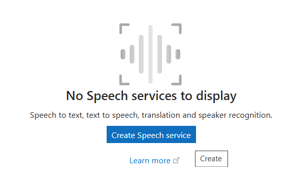

Następnie wypełniono formularz tworzenia zasobu:

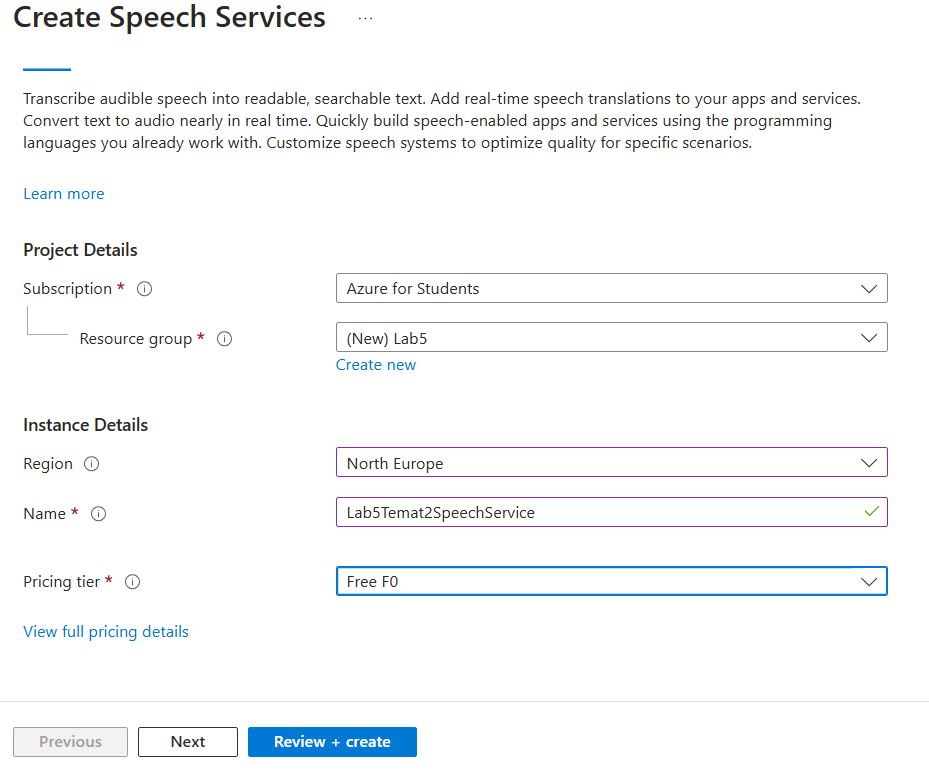

Stworzono w tym celu nowy Resource Group i wybrano region North-Europe. Wybrano opcję `Review + Create` i następnie `Create`.

Znaleziono i skopiowano Key oraz kod regionu:

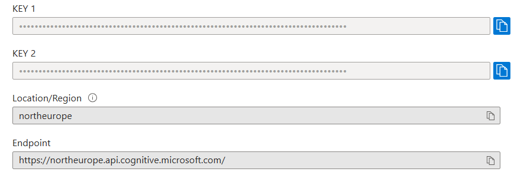

## Custom Speech

W celu realizacji zadania związanego z Custom Speech, po utworzeniu się zasobu Azure Speech Services, przeszłam do Speech Studio. Tam, stworzono zasób Custom Speech, nadając mu nazwę `CustomSpeechLab52025`. Najpierw, w sekcji `Zestawy danych mowy`, przekazano dane treningowe. Zdecydowano się na dotrenowanie modelu do poprawnego formatowania tekstu wyjściowego.

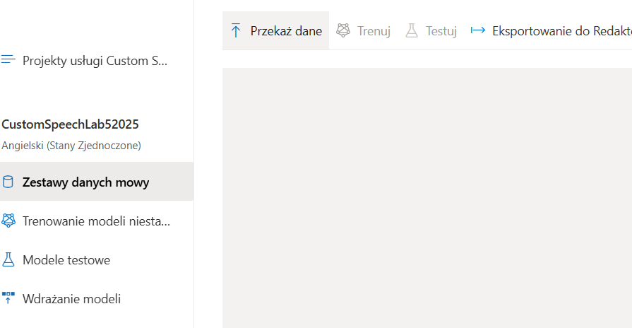

Skorzystano z oficjalnych udostępnionych przykładowych zestawów treningowych (https://github.com/Azure-Samples/cognitive-services-speech-sdk/tree/master/sampledata/customspeech/en-US/display%20formatting/training). Przekazano plik z zasadami formatowania tesktu, wybierając opcję `Format wyjściowy` przy przekazaniu danych.

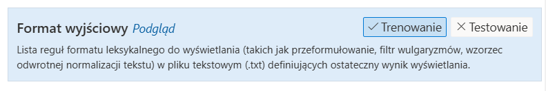

Przekazano odpowiedni plik z zasadami formatowania:

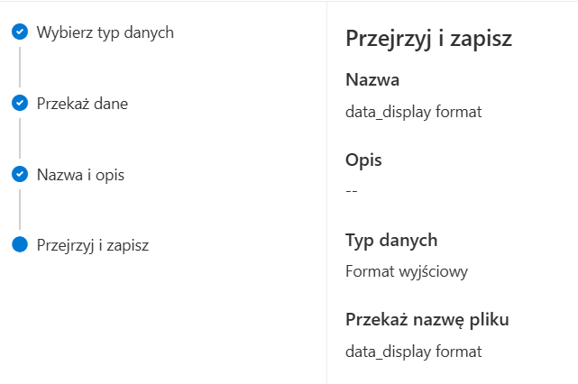

Plik został poprawnie przetworzony:

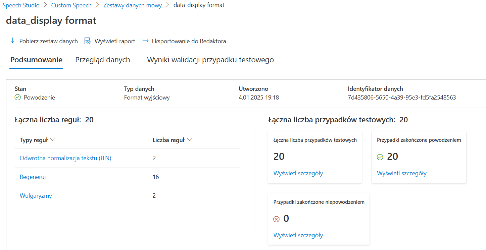

Wybrano opcję `Trenuj`, nadano nazwę nowemu modelowi i zaznaczono dwa zamieszczone pliki jako dane treningowe.

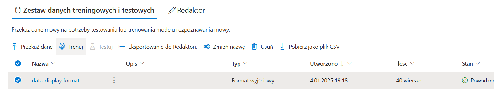

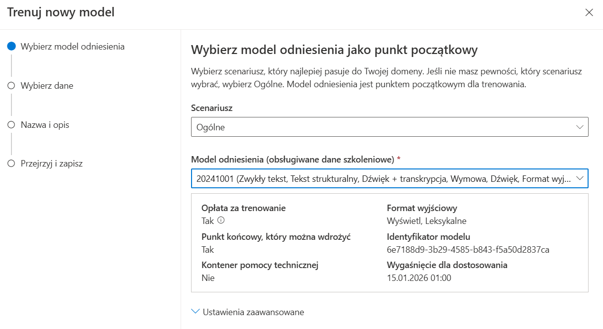

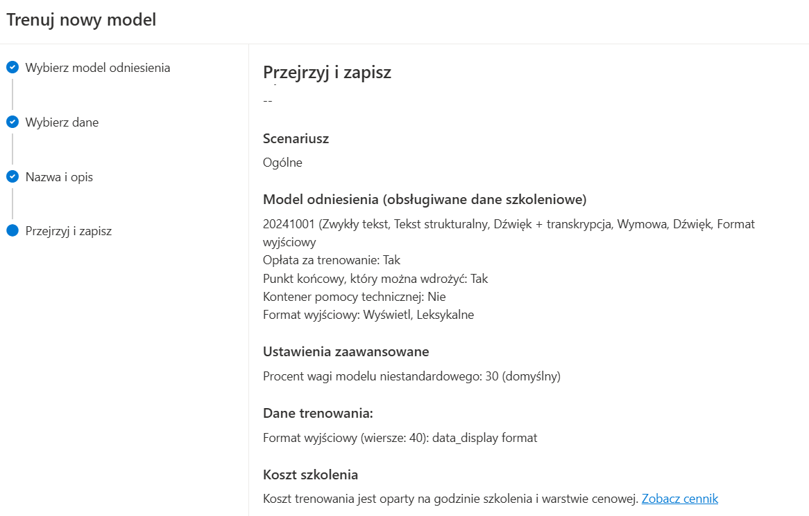

Następnie przetrenowano model.

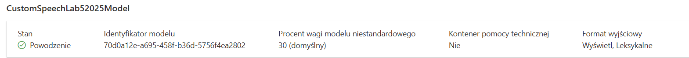

## Aplikacja

Stworzono nową aplikacje za pomocą komendy `dotnet new console -n cloudAIApp` i dodano biblioteki używane w projekcie bazowym:

```cs
  <ItemGroup>
    <PackageReference Include="Azure.AI.DocumentIntelligence" Version="1.0.0-beta.3" />
    <PackageReference Include="Docnet.core" Version="2.6.0" />
    <PackageReference Include="Microsoft.Azure.CognitiveServices.Vision.CustomVision.Prediction" Version="2.0.0" />
    <PackageReference Include="Microsoft.Azure.CognitiveServices.Vision.CustomVision.Training" Version="2.0.0" />
    <PackageReference Include="OpenAI" Version="2.0.0" />
    <PackageReference Include="PdfPig" Version="0.1.9" />
    <PackageReference Include="System.Drawing.Common" Version="9.0.0" />
  </ItemGroup>
```

Dodano bibliotekę służącą do komunikacji z Azure Speech Services oraz bibliotekę NAudio za pomocą komend:
```cs
dotnet add package Microsoft.CognitiveServices.Speech
dotnet add package NAudio
```

Przekopiowano kod z projektu bazowego (lab 4) do pliku Program.cs.

### Modyfikacja funkcji głównej

Zmodyfikowano funkcję główną Main, dodając do menu opcji 2 nowe opcje - użycie Speech to Text oraz opcji Custom Speech to Text (opcje 4 i 5).

```cs
Console.WriteLine("Select an option:");
Console.WriteLine("1. Summarize PDF and Translate Summary");
Console.WriteLine("2. Extract Image from PDF, Classify and Describe");
Console.WriteLine("3. Analyze Invoice and Validate Total");
Console.WriteLine("4. Speech to Text");
Console.WriteLine("5. Custom Speech");
Console.Write("Enter your choice (1, 2, 3, 4 or 5): ");
string choice = Console.ReadLine();

switch (choice)
{
    ...
    case "4":
        foreach (var audioFile in audioFiles){
            Console.Write("Transcribing audio file: " + audioFile);
            Console.Write("Enter the language code (e.g., 'en-US'): ");
            string language = Console.ReadLine();
            var sSpeechConfig = standardSpeechToText(language);
            performSpeechToText(audioFile, sSpeechConfig, transcriptionFolder);
        }
        break;
    case "5":
        var cSpeechConfig = customSpeechToText();
        foreach (var audioFile in audioFiles){
            Console.Write("Transcribing audio file: " + audioFile);
            performSpeechToText(audioFile, cSpeechConfig, transcriptionFolder);
        }
        break;

    default:
        Console.WriteLine("Invalid choice. Please select either 1, 2, 3, 4 or 5.");
        break;
}
```

W przypadku wybrania opcji 4, tzn standardowego Speech to Text (zadanie 2), tworzony jest obiekt klasy `SpeechConfig` za pomocą metody `standardSpeechToText`, a przypadku wybrania opcji 5 (Custom Speech), obiekt ten jest tworzony za pomocą metody `customSpeechToText`. Obiekt klasy SpeechConfig jest następnie przekazywany do metody `performSpeechToText` opisanej poniżej.

### Konfiguracja Speech Service - Zadanie 2

W celu configuracji Speech Service skorzystano z obiektu klasy `SpeechConfig`. Stworzono ten obiekt w metodzie `standardSpeechToText`:

```cs
private static SpeechConfig standardSpeechToText(string language)
{
    string subscriptionKey = "";
    string region = "northeurope";

    var config = SpeechConfig.FromSubscription(subscriptionKey, region);
    config.SpeechRecognitionLanguage = language;

    return config;
}
```

Najpierw, deklarowane są zmienne z kluczem oraz regionem do stworzonego wcześniej zasobu Speech Service. Następnie, tworzony jest obiekt klasy SpeechConfig i jest w nim ustawiany język audio wybrany przez użytkownika.

### Konfiguracja Speech Service - Custom Speech

W celu configuracji Speech Service skorzystano z obiektu klasy `SpeechConfig`. Stworzono ten obiekt w metodzie `customSpeechToText`:

```cs
private static SpeechConfig customSpeechToText(){
    string subscriptionKey = "";
    string region = "northeurope";
    string modelId = "";

    var config = SpeechConfig.FromSubscription(subscriptionKey, region);
    config.EndpointId = modelId;

    return config;
}
```

Najpierw, deklarowane są zmienne z kluczem oraz regionem do stworzonego wcześniej zasobu Speech Service. Następnie, tworzony jest obiekt klasy SpeechConfig i jest w nim ustawiany identyfikator modelu.

### Funkcjonalność Speech to Text (Zadanie 2 i Custom Speech)

Treść zadania 2 wspomniała o przyjmowaniu przez program plików audio w formie .mp3. Azure Speech Services przyjmuje jedynie pliki .wav, dlatego też napisano funkcję pomocniczą `ConvertMp3ToWav`, która korzysta z biblioteki NAudio aby przekonwertować plik .mp3 na .wav.

```cs
static string ConvertMp3ToWav(string mp3FilePath)
{
    string wavFilePath = Path.ChangeExtension(mp3FilePath, ".wav");

    try
    {
        using var reader = new Mp3FileReader(mp3FilePath);
        using var writer = new WaveFileWriter(wavFilePath, reader.WaveFormat);
        reader.CopyTo(writer);
    }
    catch (Exception ex)
    {
        Console.WriteLine($"Error during MP3-to-WAV conversion: {ex.Message}");
        throw;
    }

    Console.WriteLine($"Converted MP3 to WAV: {wavFilePath}");
    return wavFilePath;
}
```

Następnie, napisano funkcję odpowiedzialną za komunikację z Azure Speech Services w celu transkrypcji tekstu. Funkcja przyjmuje adres pliku mp3, obiekt klasy SpeechConfig oraz folder do którego mają być zapisywane transkrypcje.
```cs
private static void performSpeechToText(string mp3FilePath, SpeechConfig config, string transcriptionFolder)
```

Użyto funkcji pomocniczej do konwersji pliku audio do formatu .wav. Stworzono obiekt klasy AudioConfig, podając adres pliku audio.
```cs
string audioFilePath = ConvertMp3ToWav(mp3FilePath);

var audioConfig = AudioConfig.FromWavFileInput(audioFilePath);
```

Stworzono obiekt SpeechRecognizer i użyto jego metody `RecognizeOnceAsync` aby użyć modelu Azure Speech Services do transkrypcji podanego pliku audio.
```cs
using var recognizer = new SpeechRecognizer(config, audioConfig);
var result = recognizer.RecognizeOnceAsync().Result;
```

Następnie zinterpretowano wynik (sprawdzono czy zwrócono poprawny wynik, czy wystąpił błąd) tak jak jest to zalecane w dokumentacji (https://learn.microsoft.com/en-us/azure/ai-services/speech-service/get-started-speech-to-text?tabs=windows%2Cterminal&pivots=programming-language-csharp).

Jeśli jest to poprawny wynik, to transkrypcja jest zapisywana do pliku txt o takiej samej nazwie jak plik audio.

```cs
switch (result.Reason)
{
    case ResultReason.RecognizedSpeech:
        Console.WriteLine($"RECOGNIZED: Text={result.Text}");
        string outputFilePath = Path.Combine(
            transcriptionFolder,
            Path.GetFileNameWithoutExtension(mp3FilePath) + ".txt");
        File.WriteAllTextAsync(outputFilePath, result.Text);
        Console.WriteLine($"\nTranscription saved to {outputFilePath}");
        break;
    case ResultReason.NoMatch:
        Console.WriteLine($"NOMATCH: Speech could not be recognized.");
        break;
    case ResultReason.Canceled:
        var cancellation = CancellationDetails.FromResult(result);
        Console.WriteLine($"CANCELED: Reason={cancellation.Reason}");

        if (cancellation.Reason == CancellationReason.Error)
        {
            Console.WriteLine($"CANCELED: ErrorCode={cancellation.ErrorCode}");
            Console.WriteLine($"CANCELED: ErrorDetails={cancellation.ErrorDetails}");
            Console.WriteLine($"CANCELED: Did you set the speech resource key and region values?");
        }
        break;
}
```
Cały kod metody `performSpeechToText`:

```cs
private static void performSpeechToText(string mp3FilePath, SpeechConfig config, string transcriptionFolder)
    {
    string audioFilePath = ConvertMp3ToWav(mp3FilePath);

    var audioConfig = AudioConfig.FromWavFileInput(audioFilePath);

    using var recognizer = new SpeechRecognizer(config, audioConfig);
    var result = recognizer.RecognizeOnceAsync().Result;

    switch (result.Reason)
    {
        case ResultReason.RecognizedSpeech:
            Console.WriteLine($"RECOGNIZED: Text={result.Text}");
            string outputFilePath = Path.Combine(
                transcriptionFolder,
                Path.GetFileNameWithoutExtension(mp3FilePath) + ".txt");
            File.WriteAllTextAsync(outputFilePath, result.Text);
            Console.WriteLine($"\nTranscription saved to {outputFilePath}");
            break;
        case ResultReason.NoMatch:
            Console.WriteLine($"NOMATCH: Speech could not be recognized.");
            break;
        case ResultReason.Canceled:
            var cancellation = CancellationDetails.FromResult(result);
            Console.WriteLine($"CANCELED: Reason={cancellation.Reason}");

            if (cancellation.Reason == CancellationReason.Error)
            {
                Console.WriteLine($"CANCELED: ErrorCode={cancellation.ErrorCode}");
                Console.WriteLine($"CANCELED: ErrorDetails={cancellation.ErrorDetails}");
                Console.WriteLine($"CANCELED: Did you set the speech resource key and region values?");
            }
            break;
    }
}
```


## Test

### Test - transkrypcja tekstu / Speech to Text (Zadanie 2)

Pobrano przykładowy plik audio z https://audio-samples.github.io/#section-4 . Wybrano plik z sekcji `Single-Speaker Text-to-Speech` i umieszczono go w folderze `audio`.

Treść mowy:
```
“I like them round,” said Mary. “And they are exactly the color of the sky over the moor.”
```

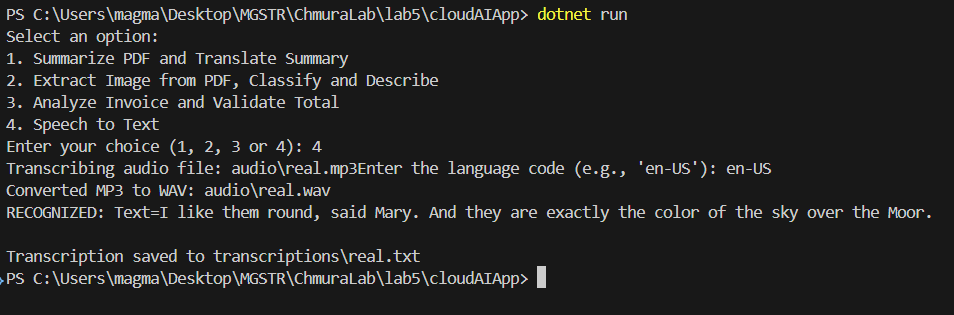

Uruchomiono program i podano język. Jak widać, program zwrócił poprawny wynik. Transkrypcja została również zapisana do pliku `real.txt` w folderze `transcriptions`.

### Test - Custom Speech

Pobrano przykładowy zestaw testowy, z tego samego repozytorium co dane treningowe.

Treść mowy:
```
Navigate to Mossy Tech.
```
Model Custom Speech powinien napisać Mossy i Tech z dużej litery, ponieważ jest to fikcyjna nazwa firmy. Umieszczono plik audio w folderze `audio`.

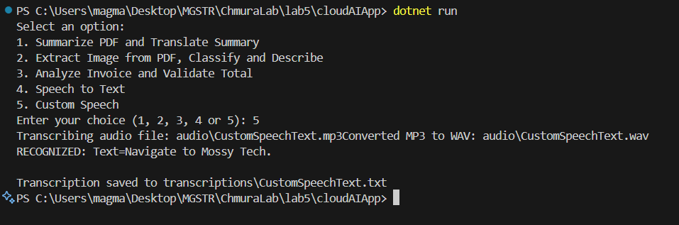

Jak widać, model zwrócił poprawnie sformatowaną transkrypcję.


