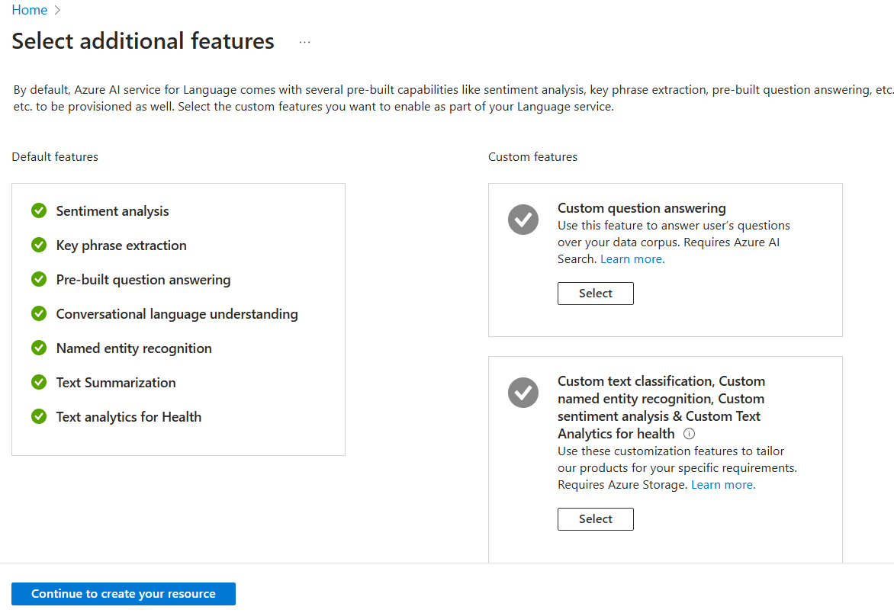
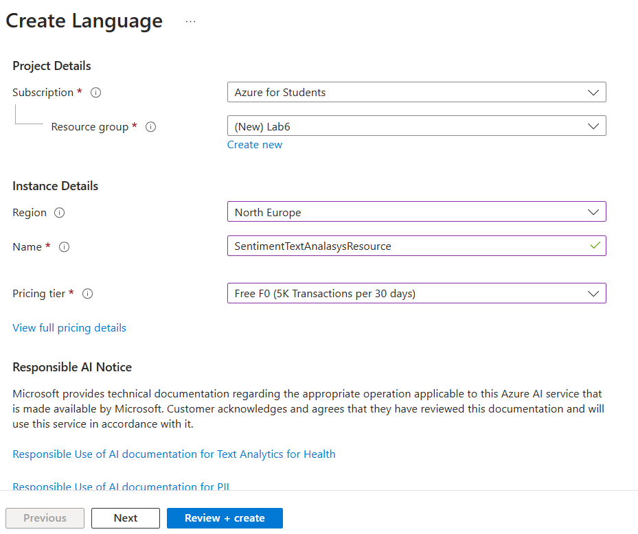
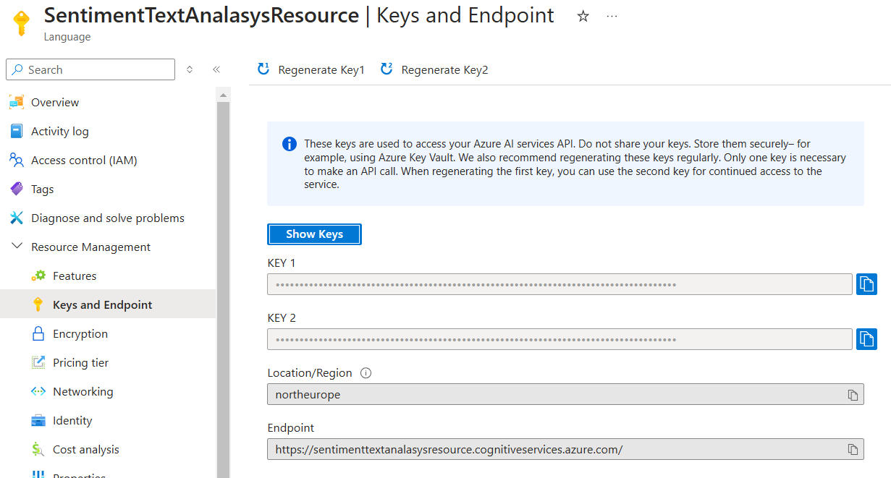
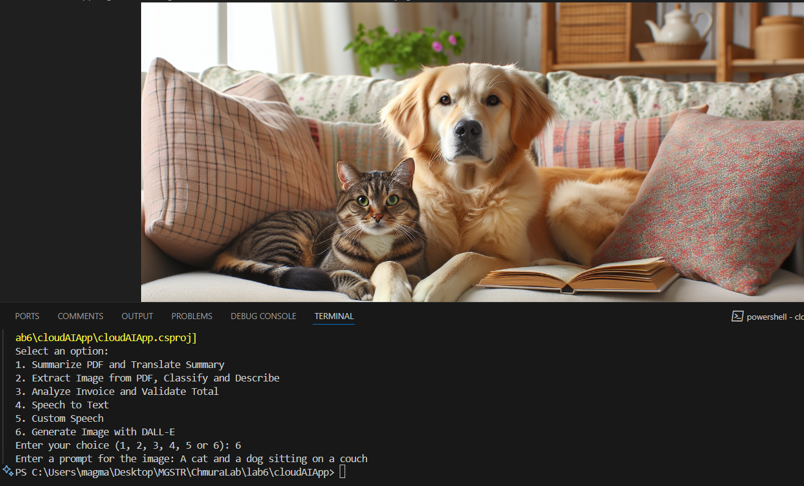
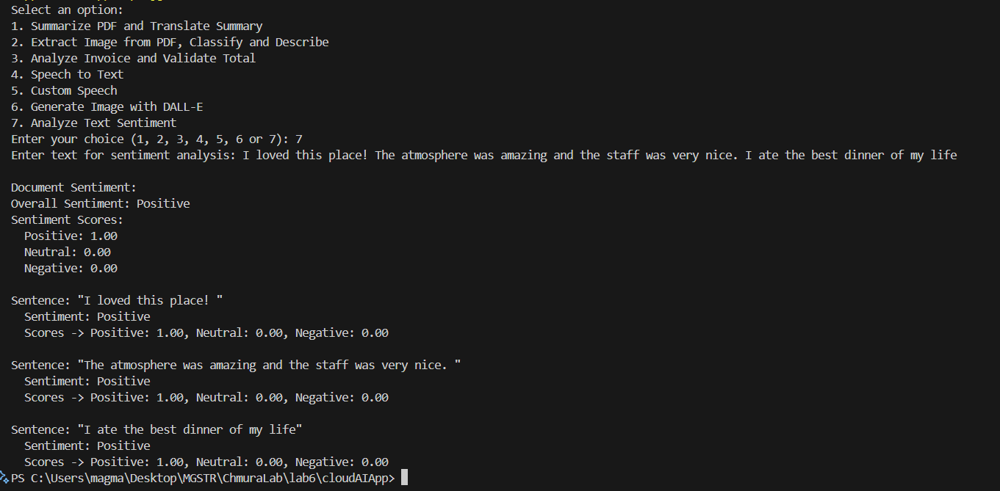

## Lab 6 - zadanie (Projekt nr. 4)

Magdalena Markowicz 310836

Link do repozytorium z rozwiązaniem zadania: https://github.com/mm-owicz/AzureLab/tree/main/lab6

Projekt bazowy:
- lab 2 - temat 4
- lab 3 - Custom Vision AI + temat 10
- lab 4 - Custom Document + temat 1
- lab 5 - Custom speech + temat 2 \
    +\
Lab 6 - Azure AI langauge Service + temat 7


### Zadania

__Projekt bazowy:__

Projekt bazowy może wykonać jedną z pięciu czyności wybranych przez użytkownika:
- podsumować tekst z pliku PDF i przetłumaczyć podsumowanie
- sczytać zdjęcia z pliku PDF i zaklasyfikować je za pomocą Custom Vision (i uzyskać opis z OpenAI)
- zananalizować, zweryfikować oraz streścić fakturę
- wygenerować transkrypcję tekstu za pomocą Azure Speech Services
- wygenerować transkrypcję tekstu za pomocą Custom Speech

__Zad 2 - Generowanie obrazów na podstawie opisu__\
   **Opis zadania:**
   - Wykorzystując API OpenAI i model DALL-E, stwórz aplikację generującą obraz na podstawie dostarczonego przez użytkownika opisu.

__Azure AI langauge Service:__\
W ramach realizacji zadania z Azure AI Language Service, zdecydowano się na implementację analizy sentymentu tekstu podanego przez użytkowika.

## Przygotowanie zasobów Azure AI Language Services

Po zalogowaniu się na Azure Portal, wyszukano i wybrano opcję tworzenia zasobu typu `AI Service for Language`.



Wybrano opcję `Continue to create your resource` i wypełniono formularz tworzenia zasobu:



Następnie wybrano opcję `Review + Create` i następnie `Create`.

Po utworzeniu zasobu, wybrano opcję `Go to resource` a następnie zakładkę `Keys and Endpoint`, gdzie znaleziono klucz oraz endpoint.




## Aplikacja

Stworzono nową aplikacje za pomocą komendy `dotnet new console -n cloudAIApp` i dodano biblioteki używane w projekcie bazowym:

```cs
<ItemGroup>
    <PackageReference Include="Azure.AI.DocumentIntelligence" Version="1.0.0-beta.3" />
    <PackageReference Include="Docnet.core" Version="2.6.0" />
    <PackageReference Include="Microsoft.Azure.CognitiveServices.Vision.CustomVision.Prediction" Version="2.0.0" />
    <PackageReference Include="Microsoft.Azure.CognitiveServices.Vision.CustomVision.Training" Version="2.0.0" />
    <PackageReference Include="NAudio" Version="2.2.1" />
    <PackageReference Include="OpenAI" Version="2.0.0" />
    <PackageReference Include="PdfPig" Version="0.1.9" />
    <PackageReference Include="System.Drawing.Common" Version="9.0.0" />
    <PackageReference Include="Microsoft.CognitiveServices.Speech" Version="1.42.0" />
</ItemGroup>
```

Dodano bibliotekę potrzebną do komunikacji z serwisem Azure AI Language Service za pomocą komendy:

```cs
dotnet add package Azure.AI.TextAnalytics
```

Skopiowano kod z projektu bazowego (lab 5).

### Modyfikacja funkcji głównej Main

Zmodyfikowano funkcję Main, dodając do niej 2 nowe opcje - generowania obrazków za pomocą DALL-E (opcja 6) lub analiza sentymentu tekstu za pomocą Azure AI Language Services (opcja 7).

```cs
Console.WriteLine("Select an option:");
Console.WriteLine("1. Summarize PDF and Translate Summary");
Console.WriteLine("2. Extract Image from PDF, Classify and Describe");
Console.WriteLine("3. Analyze Invoice and Validate Total");
Console.WriteLine("4. Speech to Text");
Console.WriteLine("5. Custom Speech");
Console.WriteLine("6. Generate Image with DALL-E");
Console.WriteLine("7. Analyze Text Sentiment");
Console.Write("Enter your choice (1, 2, 3, 4, 5, 6 or 7): ");
string choice = Console.ReadLine();

switch (choice)
{
    ...
    case "6":
        Console.Write("Enter a prompt for the image: ");
        string prompt = Console.ReadLine();
        GenerateImageWithDescription(prompt, openAIApiKey, generatedImagesFolder);
        break;
    case "7":
        Console.Write("Enter text for sentiment analasys: ");
        string text = Console.ReadLine();
        GetTextSentiment(text);
        break;

    default:
        Console.WriteLine("Invalid choice. Please select either 1, 2, 3, 4, 5, 6 or 7.");
        break;
}
```
Wybranie opcji 6 wywołuje funkcję `GenerateImageWithDescription` i powoduje zapisanie wygenerowanego obrazka. Wybranie opcji 7 powoduje wywołanie funkcji `GetTextSentiment` i wypisanie analizy sentymentu do konsoli.

### Generowanie obrazków za pomocą OpenAI API

Wymaganą bibliotekę OpenAI zainstalowano przy okazji realizacji poprzednich zadań.

W ramach implementacji generowania obrazów za pomocą DALL-E, zaimplementowano metodę `GenerateImageWithDescription`.

```cs
static async Task GenerateImageWithDescription(string prompt, string key, string generatedImagesFolder){
    ImageClient client = new("dall-e-3", key);

    ImageGenerationOptions options = new()
    {
        Quality = GeneratedImageQuality.Standard,
        Size = GeneratedImageSize.W1792xH1024,
        ResponseFormat = GeneratedImageFormat.Bytes
    };

    GeneratedImage image = client.GenerateImage(prompt, options);
    BinaryData bytes = image.ImageBytes;

    using FileStream stream = File.OpenWrite($"{generatedImagesFolder}/{Guid.NewGuid()}.png");
    bytes.ToStream().CopyTo(stream);
}
```

Stworzono obiekt klienta DALL-E `ImageClient`, podając wybraną nazwę modelu i klucz API. Podano odpowiednie opcje generacji obrazu do obiektu klasy `ImageGeerationOptions` i za pomocą metody `GenerateImage` wygenerowano obrazek na podstawie opisu podanego przez użytkowika. Obrazek jest następnie zapisywany do folderu generatedImages.

### Analiza sentymentu za pomocą Azure AI Language Services

W celu implementacji analizy sentymentu za pomocą Azure AI Language Services, zaimplementowaną funkcję `GetTextSentiment`, przyjumjącą tekst podany przez użytkownika do analizy.

```cs
static async Task GetTextSentiment(string inputText){
    string endpoint = "";
    string apiKey = "";

    var client = new TextAnalyticsClient(new Uri(endpoint), new AzureKeyCredential(apiKey));
    Console.WriteLine("\nDocument Sentiment:");
    try
    {
    Response<DocumentSentiment> response = client.AnalyzeSentiment(inputText);
    DocumentSentiment documentSentiment = response.Value;

    Console.WriteLine($"Overall Sentiment: {documentSentiment.Sentiment}");
    Console.WriteLine("Sentiment Scores:");
    Console.WriteLine($"  Positive: {documentSentiment.ConfidenceScores.Positive:0.00}");
    Console.WriteLine($"  Neutral: {documentSentiment.ConfidenceScores.Neutral:0.00}");
    Console.WriteLine($"  Negative: {documentSentiment.ConfidenceScores.Negative:0.00}");

    foreach (var sentence in documentSentiment.Sentences)
    {
        Console.WriteLine($"\nSentence: \"{sentence.Text}\"");
        Console.WriteLine($"  Sentiment: {sentence.Sentiment}");
        Console.WriteLine($"  Scores -> Positive: {sentence.ConfidenceScores.Positive:0.00}, Neutral: {sentence.ConfidenceScores.Neutral:0.00}, Negative: {sentence.ConfidenceScores.Negative:0.00}");
    }
}
catch (RequestFailedException ex)
{
    Console.WriteLine($"Error: {ex.Message}");
}
}
```

Najpierw, deklarowane są zmienne z endpointem i kluczem. Następnie, tworzony jest obiekt klasy `TextAnalyticsClient` służący do komunikacji z modelem analizy tekstu Azure AI Language Service.
Za pomocą metody `AnalyzeSentimentAsync`, program wysyła zapytanie do modelu i otrzymuje odpowiedź jako obiekt klasy `DocumentSentiment`. Przeanalizowany sentyment
wraz z pewnością modelu są następnie wypisywane do konsoli.


## Test

### Test - generacja obrazka za pomocą DALL-E

Uruchomiono aplikację, podając opis obrazka.



Jak widać, program poprawnie wygenerował obrazek.

### Test - analiza sentymentu tekstu (Azure AI Language Service)

Uruchomiono aplikację i podano tekst do analizy.



Jak widać, program poprawnie zananalizował sentyment podanego tekstu.


