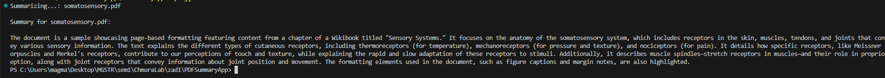
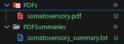
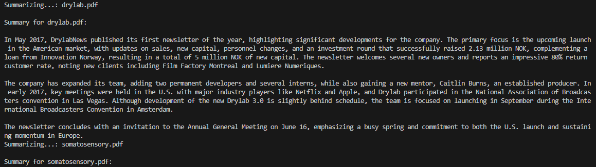
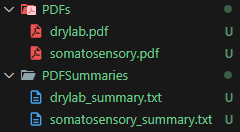

## Zadanie laboratoryjne 1

Link do repozytorium z rozwiązaniem zadania: https://github.com/mm-owicz/AzureLab/tree/main/zad1

Przypisany nr. zadania: 4

### **Tworzenie streszczenia treści dokumentu PDF**
   **Opis zadania:**
   - Korzystając z OpenAI API (np. GPT-4), załaduj plik PDF, a następnie prześlij jego zawartość do modelu, aby wygenerował streszczenie.
   - Wygenerowane streszczenie zapisz w pliku i wyświetl w konsoli.
   - Program powinien mieć możliwość wygenerowania streszczeń wielu plików umieszczonych w folderze

## Przygotowanie środowiska aplikacji

.Net zainstalowano przy wykonywaniu lab 1.

Za pomocą komendy `dotnet new console -n PDFSummaryApp` storzono szablon aplikacji C#. Po przejściu do folderu aplikacji, zainstalowano potrzebne biblioteki - OpenAI i Docnet.Core. Użyto komend:

`dotnet add package OpenAI` oraz `dotnet add package Docnet.Core`

zamiast komend, można też po prostu dodać biblioteki w pliku .csproj:

```
  <ItemGroup>
    <PackageReference Include="Docnet.core" Version="2.6.0" />
    <PackageReference Include="OpenAI" Version="2.0.0" />
  </ItemGroup>
```

## Przygotowanie konta Open AI

Założono konto na stronie platform.openai.com. W ustawieniach, w zakładce "Billing", dodano dane karty i wpłacono minimalną sumę kredytów, czyli $5.00.

W zakładce API keys, po potwierdzeniu numeru telefonu, stworzono API key. Zapisano go w Environmental Variables za pomocą komendy `setx OPENAI_API_KEY="mój klucz"`.

## Napisanie aplikacji

W pliku `Program.cs`, napisano odpowiedni program.

Program najpierw pobiera API key, który wcześniej stworzono i wyeksportowano:
```c#
string apiKey = Environment.GetEnvironmentVariable("OPENAI_API_KEY");
if (string.IsNullOrEmpty(apiKey))
{
    Console.WriteLine("No API key found.");
    return;
}
```

Następnie, stworzono instancję klasy ChatClient, która będzie służyła do przesłania zapytania do wybranego modelu. Wybrano model GPT-4o-mini.
```c#
ChatClient client = new("gpt-4o-mini", apiKey);
```

Stworzono folder PDFs, w którym będą się znajdować PDFy do streszczenia. Zainicjalizowano zmienne z ścieżką do folderu PDFs i do folderu w którym będą streszczenia PDFów. Za pomocą `Directory.CreateDirectory()`, tworzony jest folder z streszczeniami (jeśli już nie istnieje). Pobrano wszystkie pliki PDF do zmiennej pdfFiles.
```c#
string pdfFolder = @"C:\Users\magma\Desktop\MGSTR\sem1\ChmuraLab\zad1\PDFSummaryApp\PDFs";
string summaryFolder = @"C:\Users\magma\Desktop\MGSTR\sem1\ChmuraLab\zad1\PDFSummaryApp\PDFSummaries";

Directory.CreateDirectory(summaryFolder);
var pdfFiles = Directory.GetFiles(pdfFolder, "*.pdf");
```

W głównej pętli, program przechodzi po plikach PDF, pobiera z nich tekst (za pomocą mojej funkcji `ExtractTextFromPdf`, opisanej poniżej) i przesyła ten tekst do modelu, uzyskując streszczenie (za pomocą mojej funkcji `GenerateSummary`, opisanej poniżej). Streszczenie jest zapisywane do pliku i wyświetlane w konsoli.
```c#
foreach (var pdfFile in pdfFiles)
{
    Console.WriteLine($"Summarizing...: {Path.GetFileName(pdfFile)}");
    string text = ExtractTextFromPdf(pdfFile);

    if (string.IsNullOrEmpty(text))
    {
        Console.WriteLine($"No text found in {pdfFile}");
        continue;
    }

    string summary = await GenerateSummary(client, text);

    string summaryFilePath = Path.Combine(summaryFolder, Path.GetFileNameWithoutExtension(pdfFile) + "_summary.txt");
    File.WriteAllText(summaryFilePath, summary);

    Console.WriteLine($"\nSummary for {Path.GetFileName(pdfFile)}:\n");
    Console.WriteLine(summary);
    }
```

Funkcja `ExtractTextFromPdf` używa biblioteki `DocDocnet.Core` do sczytania tekst z pliku PDF. W momencie pisaniu kodu, według dokumentacji OpenAI, API OpenAI nie przyjmuje wejścia w formie PDF, tylko tekstowej.
```c#
static string ExtractTextFromPdf(string filePath)
{

    var textContent = string.Empty;
    using (var library = DocLib.Instance)
    {
        using (var docReader = library.GetDocReader(File.ReadAllBytes(filePath), new PageDimensions(1080, 1920)))
        {
            var pageCount = docReader.GetPageCount();

            for (int i = 0; i < pageCount; i++)
            {
                using (var pageReader = docReader.GetPageReader(i))
                {
                    var pageText = pageReader.GetText();
                    textContent += pageText + Environment.NewLine;
                }
            }
        }
    }
    return textContent;
}

```

Funckja `GenerateSummary` korzysta z wcześniej stworzonej instancji klasy `ChatClient` i metody `.CompleteChat()` do przesłania zapytania do wybranego modelu. Funkcja zwraca wygenerowane streszczenie.
```c#
static async Task<string> GenerateSummary(ChatClient client, string text)
{

    ChatCompletion completion = client.CompleteChat($"Write a summary of this text: {text}");

    return completion.Content[0].Text;
}
```

Cały kod znajduje się w pliku Program.cs w repozytorium do którego link został umieszczony na górze sprawozdania.

## Test

Pobrano przykładowy PDFy z strony https://www.princexml.com/samples/.

#### Przykład 1:
W folderze PDFs umieszczono PDF `somatosensory.pdf`, będący fragmentem książki. Uruchomiono aplikację za pomocą komendy `dotnet run`.

Program wypisał streszczenie w konsoli:


i stowrzył plik z streszczeniem w odpowiednim katalogu:


Treść streszczenia:
```
The document is a sample showcasing page-based formatting featuring content from a chapter of a Wikibook titled "Sensory Systems." It focuses on the anatomy of the somatosensory system, which includes receptors in the skin, muscles, tendons, and joints that convey various sensory information. The text explains the different types of cutaneous receptors, including thermoreceptors (for temperature), mechanoreceptors (for pressure and texture), and nociceptors (for pain). It details how specific receptors, like Meissner corpuscles and Merkel's receptors, contribute to our perceptions of touch and texture, while explaining the rapid and slow adaptation of these receptors to stimuli. Additionally, it describes muscle spindles—stretch receptors in muscles—and their role in proprioception, along with joint receptors that convey information about joint position and movement. The formatting elements used in the document, such as figure captions and margin notes, are also highlighted.
```

#### Przykład 2:
W folderze PDFs umieszczono PDF `drylab.pdf`, będący fragmentem newslettera. Uruchomiono aplikację za pomocą komendy `dotnet run`.

Program wypisał streszczenie w konsoli:


i stowrzył plik z streszczeniem w odpowiednim katalogu:


Treść streszczenia:
```
In May 2017, DrylabNews published its first newsletter of the year, highlighting significant developments for the company. The primary focus is the upcoming launch in the American market, with updates on sales, new capital, personnel changes, and an investment round that successfully raised 2.13 million NOK, complementing a loan from Innovation Norway, resulting in a total of 5 million NOK of new capital. The newsletter welcomes several new owners and reports an impressive 80% return customer rate, noting new clients including Film Factory Montreal and Lumiere Numeriques.

The company has expanded its team, adding two permanent developers and several interns, while also gaining a new mentor, Caitlin Burns, an established producer. In early 2017, key meetings were held in the U.S. with major industry players like Netflix and Apple, and Drylab participated in the National Association of Broadcasters convention in Las Vegas. Although development of the new Drylab 3.0 is slightly behind schedule, the team is focused on launching in September during the International Broadcasters Convention in Amsterdam.

The newsletter concludes with an invitation to the Annual General Meeting on June 16, emphasizing a busy spring and commitment to both the U.S. launch and sustaining momentum in Europe.
```

Program wygenerował też ponowne streszczenie dla poprzedniego pliku PDF, ponieważnie usunięto do z folderu PDFs.
